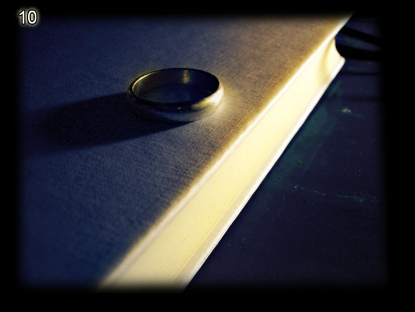
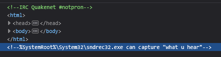

# Level 10

[Link level](https://www.deathball.net/notpron/wrong/roawr.htm)

**Difficulty:** Easy

## Preview

## Solution
Once again inspecting the page helped me, in fact in the inspected page there was a comment that said to use sndrec32.exe

after doing a little research i found out that sndrec32.exe was an audio recorder and editor that was present on windows, what i did was search for an audio editor online and finally i found [this](https://audiomass.co/), after that I uploaded the mp3 file from the site and did some investigating and after changing the speed of the sound from 1x to 2.5x and after applying reverse I was able to hear the hidden message which was dark times, after that I clicked on the bowl in the image and entered my credentials — and boom, level 10 completed! 

---

_Time taken: 1 minute_
