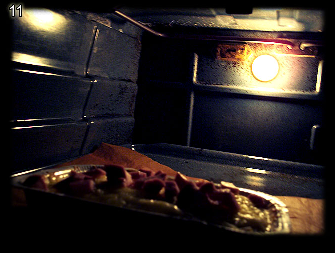
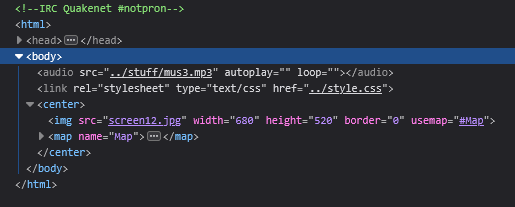
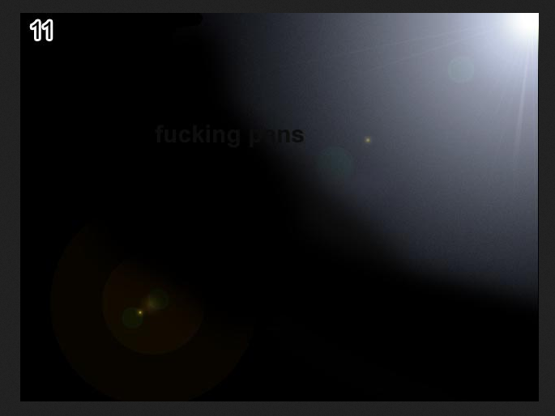

# Level 11

[Link level](https://www.deathball.net/notpron/reality/mystery.htm)

**Difficulty:** Easy

## Preview

## Solution
As usual the first thing I did was inspect the source code and that's where I noticed that the image was called screen12.jpg and I found it very strange considering that I was at level 11

So what i did was replace screen12.jpg with screen11.jpg and that's where i found a new image

In the image there were two words, namely fucking and pans and I guessed they were the credentials, so I pressed the yellow circle in the image and entered the credentials — and boom, level 11 completed! 

---

_Time taken: 5 minutes_
