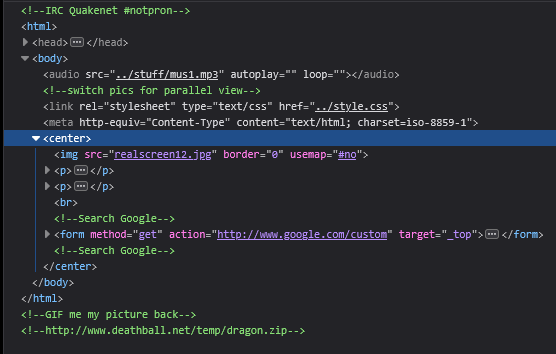

# Level 12

[Link level](https://www.deathball.net/notpron/blame/crossview.htm)

**Difficulty:** Easy

## Preview

## Solution
In this case too I opened the developer tools and stopped to read the comments

Among these comments was a link to a zip file, which ultimately turned out to be useless, but the same cannot be said for the other comments, in fact the second comment contained switch pics, while the third contained the word GIF, which made me guess that I had to swap realscreen12.jpg with realscreen12.gif, after that the new link led to a normal gif file and it is here that I saw the writing present in the image again, namely "I'm ruining the third dimension", and it is thanks to this sentence that I noticed that in the gif the remote control was moving, and from here I guessed that the credentials were indeed remote and control, at this point I clicked on the 12 in the image and entered the credentials — and boom, level 12 completed!

---

_Time taken: 5 minutes_
