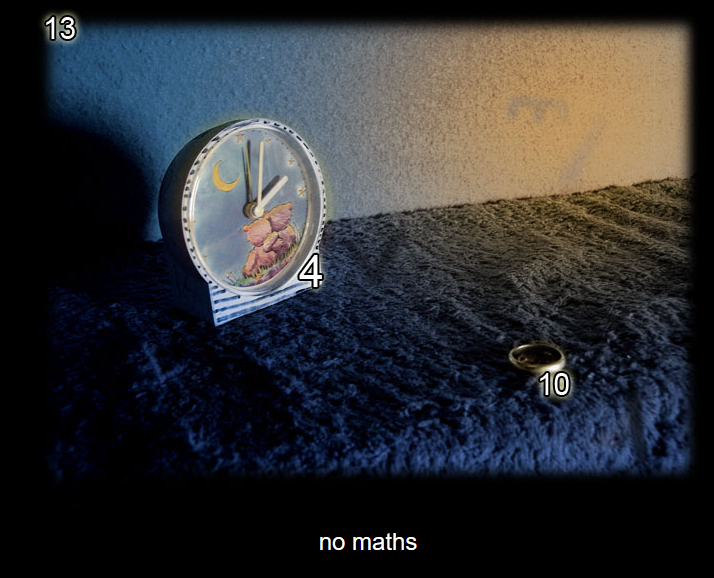
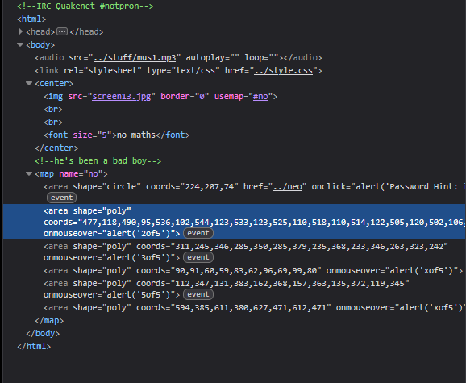
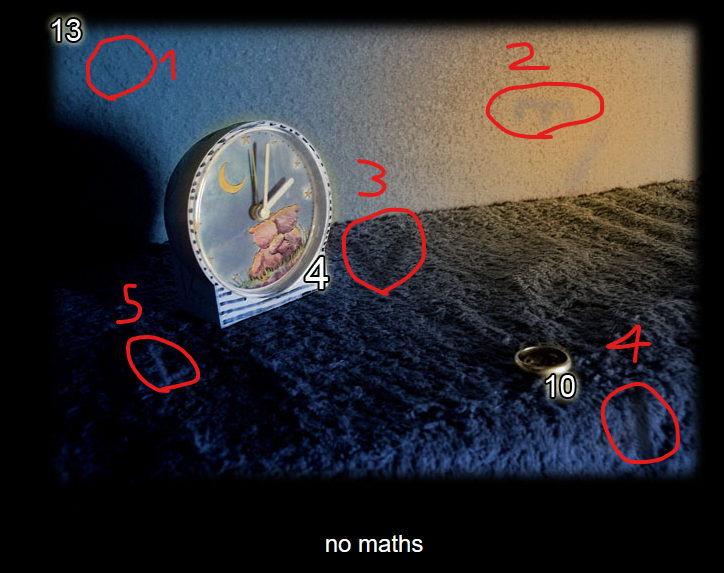
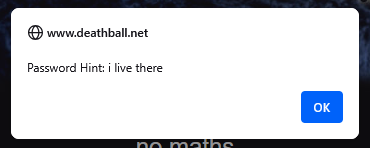

# Level 13

[Link level](https://www.deathball.net/notpron/ps/afterdeath.htm)

**Difficulty:** Easy

## Preview

## Solution
As usual I opened the developmer tools to inspect the code

In the inspected code you can clearly see some coordinates that say x of 5, looking for these coordinates in the image you can see some symbols

By putting the letters together in the correct order we get d3vil which can also be read as devil, and we have confirmation of this thanks to the comment in the code which says that 'he has been a bad boy', after that I clicked on the clock in the image which gave me another hint

And where does the devil live? The answer is in hell, so I guessed the credentials were devil and hell, so I entered these credentials — and boom, level 13 completed!

---

_Time taken: 10 minutes_
