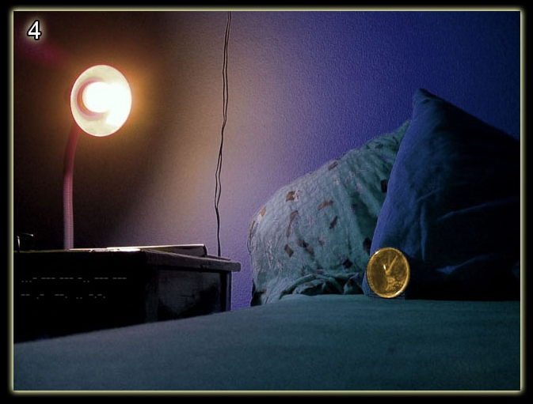
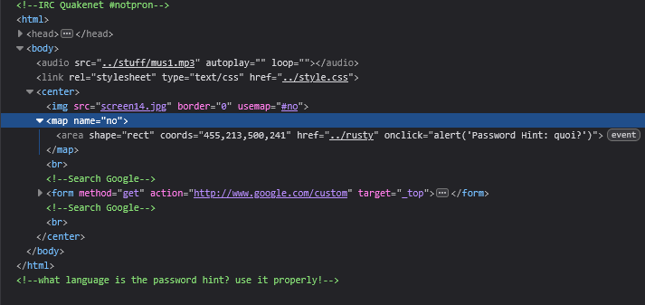
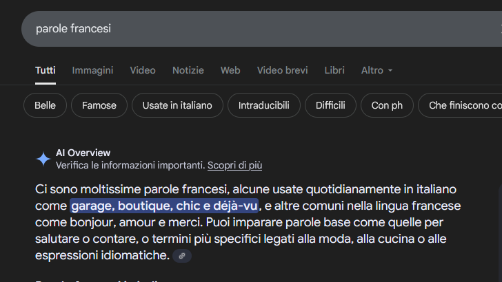

# Level 14

[Link level](https://www.deathball.net/notpron/neo/beenthere.htm)

**Difficulty:** Hard

## Preview

## Solution
This was the first really complicated level I found, as usual I tried to use the developer tools but in this case the suggestions were very ambiguous

As you can read in the code, there is the word 'quoi' which means 'what' in English and then there is a comment that asks the language of the word, the language is very simple to guess and it is the French language, despite this information I was blocked for about 15 minutes, after that I searched the internet for 'French words' and here the artificial intelligence Gemini, randomly, suggested the word déjà-vu

After reading this word I connected all the various dots, the image was in fact very similar to the one in level 5 which meant that we were thinking about the past and that's why the word déjà-vu was perfect, so I clicked on the remote control and entered deja and vu as username and password — and boom, level 14 completed!

---

_Time taken: 15 minutes_
