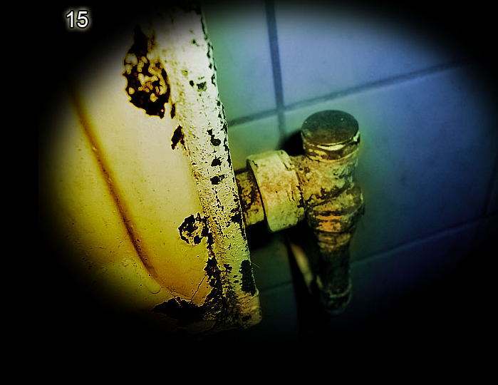
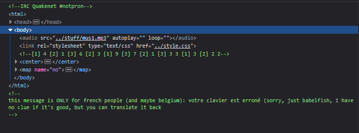

# Level 15

[Link level](https://www.deathball.net/notpron/rusty/board.htm)

**Difficulty:** Medium

## Preview

## Solution
This level was also quite complicated but above all very confusing, and obviously required the use of developer tools to inspect the page

As you can see, in the comments there is a message written in French that if translated says 'wrong keyboard' and also there is a code to decode, the message wrong keyboard was the one that confused me the most since I thought I had to use the azerty instead of the qwerty (for those who don't know, in France they use an azerty keyboard which therefore has the keys in a different position than the qwerty), in any case all this turned out to be wrong in the end since to decode it you had to use the qwerty (actually it was specified ONLY for french people) and after about 40 minutes I understood the logic behind the hidden message, the numbers inside the [] indicate the row of the keyboard while the next number indicates the position of the key, following this logic we get the message random access, after that I clicked on the button in the image and entered the credentials — and boom, level 15 completed!

---

_Time taken: 40 minutes_
