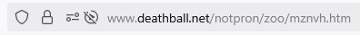

# Level 16

[Link level](https://www.deathball.net/notpron/zoo/mznvh.htm)

**Difficulty:** Hard

## Preview


## Solution
I won't lie, this level gave me a headache, and that's also why it took me 4 days to decide to finish the level, anyway of course I started by inspecting the code


It took me a while to understand that the comments in the code were suggestions to solve the level, the most important one was the "invert az" one, after wasting quite a few minutes I understood that it meant that the letters of the alphabet should be considered backwards, so instead of a there would be z, instead of b there would be v and so on, to help me in this task I wrote a mini python code

```python
import string

az = string.ascii_lowercase
za = az[::-1]

def decrypt(word):
    result = ""
    for letter in word:
        index = az.index(letter)
        result += za[index]
    return result

message = input("insert the message you want to decrypt: ")

print(decrypt(message))
```

In the comments of the page code you can also notice a message encrypted with the algorithm I explained above (# = ellwll/hrnkov/proo/...), then I ran my python code with the words ellwll, hrnkov and proo and I got the words voodoo, simple and kill respectively, you can also notice that at the beginning of the comment there is # equals and in the image, there are some levels with the #, which made me guess that I had to use this algorithm with something present in the previous levels.
I continued my research for a few more minutes until I noticed the title of the page



As you can see in the image, the words zoo and mznvh are present, and by running the algorithm I created on these words we get all and names respectively, which made me realize that they were related to names, after having wasted many more minutes in research I realized that all the levels with 0 were levels that did not contain usernames and passwords, while the others did, furthermore if we think about it, the only names we entered are precisely the usernames which made me realize that the solution was to be found in the usernames present on those pages, below I leave a list with all the various names of the usernames of the levels

- Level 4: voodoo
- Level 5: simple
- Level 6: kill
- Level 8: inverted
- Level 9: turnmeon
- Level 11: fucking
- Level 12: remote
- Level 13: devil
- Level 14: deja
- Level 15: random

Also in the initial image of the level, we can notice some numbers in addition to the numbers indicating the level, after several attempts I realized that these numbers meant which character to take, for example if the number was 1 then I would have taken the first character, if it was 2 the second and so on, in any case after doing this I obtained dllnmfrder, which had no meaning, until I remembered the # present in some levels, so what I did was to call my algorithm only on the characters taken in the levels that contained #, after doing this I obtained doommurder, if we separate these two words we get doom and murder respectively, that is our credentials, so I clicked on the button in the image at the bottom right and entered the credentials — and boom, level 16 completed!

---


_Time taken: 1 hour and 22 minutes_
