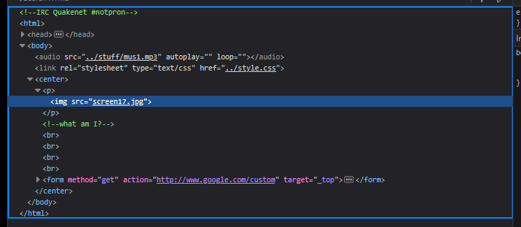

# Level 17

[Link level](https://www.deathball.net/notpron/finale/pron.htm)

**Difficulty:** Easy

## Preview

## Solution
The previous levels were quite complicated, fortunately this level was quite simple and obviously required reading the source code of the page with the developer tools

As you can see from the image, the solution to the level will be found after we understand what the image represents, to understand what the image represents we must read the title of the page

It's very easy to understand what the image represents, we know that it has to do with light and aliens, so obviously the answer is ufo, so I replaced pron in the url with ufo and another page was loaded here

The page says it has nothing to do with aliens, so after wasting some time I figured out that the solution had to do with light, and after trying a few words I found the solution, which was lamp, so I replaced ufo in the url with lamp — and boom, level 17 completed!

---

_Time taken: 20 minutes_
