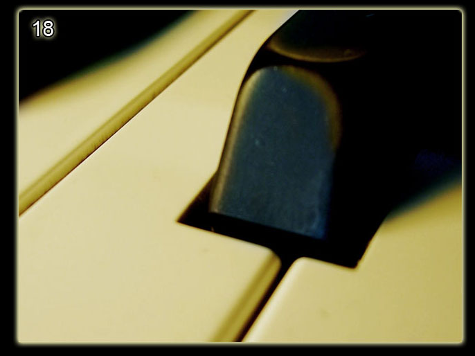
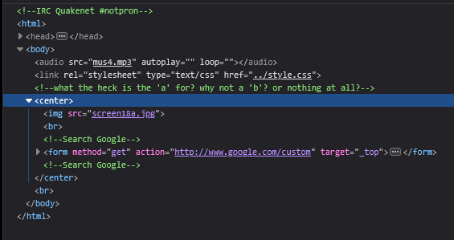
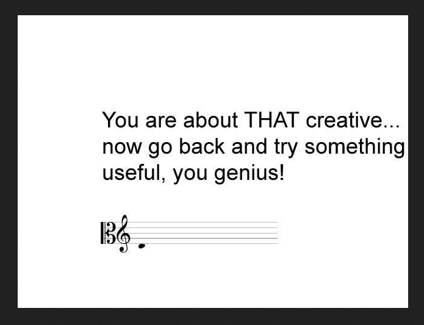

# Level 18

[Link level](https://www.deathball.net/notpron/finale/lamp.htm)

**Difficulty:** Medium

## Preview

## Solution
This level required knowledge in the musical field and obviously also the developer tools so as always I analyzed the page

As you can see from the comment, we are told to replace the a with the b and with nothing, if you look carefully you will notice that the name of the image contains the letter a, so the first thing I did was replace the a with the b, then with the c and so on until the end of the alphabet but in the end I did not find anything useful (except photos of booba, I admit that all this made me laugh a lot), after which I removed the a and I got this photo

The photo clearly tells us that we are going in the wrong direction, but it also shows us a score, so what I did was go back to the home page and there I noticed that the mp3 file was different from the classic one, so what I did was listen to that sound and I noticed that it was from a piano, and this is where my dad comes in, you should know that I really suck at music (I don't understand anything about it), so what I did was ask my dad to tell me the musical notes in the audio and my dad told me that they were D, E, A, F, so I tried replacing lamp with deaf — and boom, level 18 completed!

---

_Time taken: 30 minutes_
