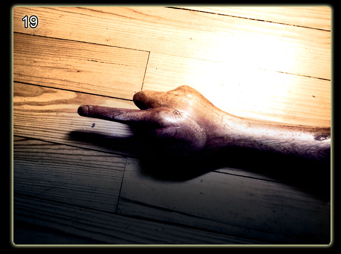
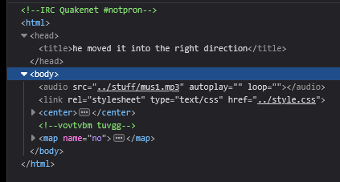

# Level 19

[Link level](https://www.deathball.net/notpron/finale/deaf.htm)

**Difficulty:** Easy

## Preview


## Solution
This level was particular because there was practically nothing to analyze, in any case I tried with the developer tools



The first thing you notice in the inspected code is a comment, I thought it was the credentials but obviously it would have been too easy and so I made various attempts even trying to decrypt it with the level 16 algorithm but obviously it was completely useless, after about 20 minutes of thinking about various solutions I noticed that the title of the page said that the hand was pointing in the correct direction, that is left, so my idea was to take each letter and move it to the left by 1 position, in a few words the letter b became a, the c became b and so on, basically a Caesar Cipher

```python
import string

az = string.ascii_lowercase

def decrypt(word):
    result = ""
    for letter in word:
        index = az.index(letter)
        result += az[index - 1]
    return result

message = input("insert the message you want to decrypt: ")

print(decrypt(message))
```

Running this code with the two words in the comment we get respectively unusual and stuff, then I clicked on the finger in the image and entered the credentials — and boom, level 19 completed!

---


_Time taken: 20 minutes_
