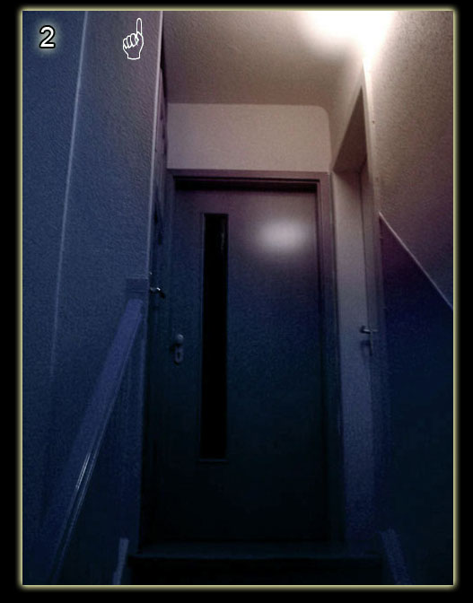
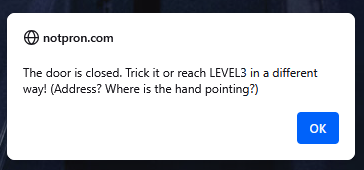

# Level 2

[Link level](https://notpron.com/notpron/not/level2.htm)

**Difficulty:** Very easy

## Preview

## Solution
In this level too, you can see a door, but this time if we try to click on it we will get:

The message gives us suggestions on how to move to the next level: it tells us Address and where is the hand pointing?
These suggestions indicate that we need to change the site's web address, so we replace level2 in the URL with level3 and level 2 solved.

---

_Time taken: 15 seconds_
