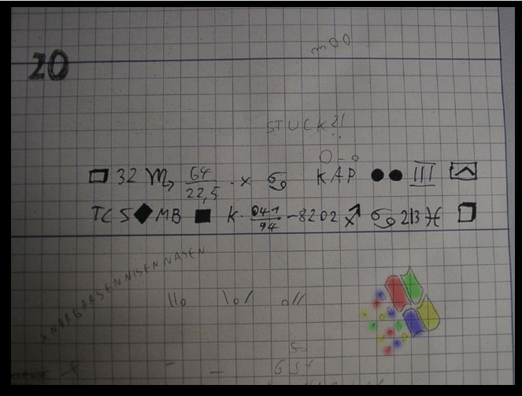
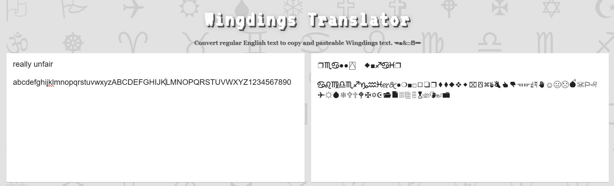

# Level 20

[Link level](https://www.deathball.net/notpron/windows/something.php)

**Difficulty:** Hard

## Preview

## Solution
Honestly, I thought I'd be stuck at this level forever, in fact, when I opened the developer tools, nothing useful was found, and in fact, this level was solved by luck and thanks to the help of the AI.

You should know that I hate math and I'm one of those people who thinks math isn't necessary to be a good programmer, however, getting back to us, I thought I'd be stuck at this level forever because I thought math was required, and this hatred of math helped me, in fact, 

I skipped all the numbered parts and started with an idea: if you notice in the image, there are two lines made up of letters/numbers/symbols, so the first thing I did was think these were the credentials, so I started with the part that seemed easiest to decode, namely the symbols, what I did was ask chatgpt for fonts that replaced letters/numbers with special characters, and chatgpt suggested Wingdings as the first result.

What I did was go to this [website](https://lingojam.com/WingdingsTranslator) and start typing all the characters.

As you can see I was lucky enough to find the same symbols present in the image and in the end by replacing these symbols with letters I got the words really and unfair and what I did was click on the Windows logo present in the image and try to insert these two words as credentials, honestly I doubted that it would work and instead — boom, level 20 completed!

---

_Time taken: 40 minutes_
