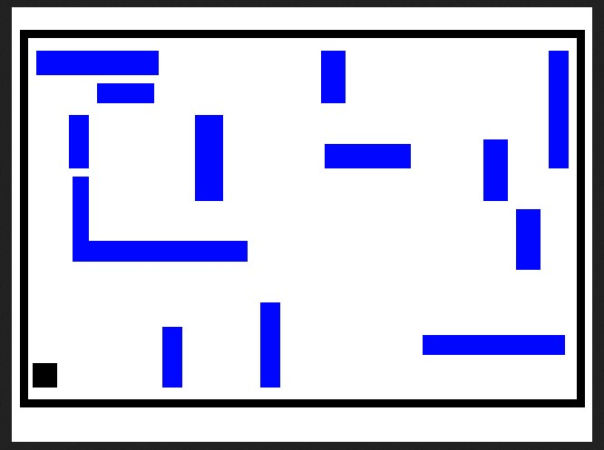

# Level 21

[Link level](https://www.deathball.net/notpron/twentyone/again.htm)

**Difficulty:** Easy

## Preview


## Solution
This level was particularly easy but would have taken a long time to solve manually and like always I opened the developer tools


As you can see from the inspected code you see an image called white.jpg, in the start level image you can see some color names written, so I did the most obvious thing to do which was to replace white with the name of those colors and I got this:



Each color is associated with an image containing a path and therefore the most obvious thing to do is to complete the path by joining the various images, but doing it manually would have taken too much time, so I created a python code that did it for me:

```python
import numpy as np

from PIL import Image

def remove_white(img):
    img = img.convert("RGBA")
    data = np.array(img)

    r, g, b, _ = data.T
    mask = (r > 240) & (g > 240) & (b > 240)

    data[..., 3][mask.T] = 0
    return Image.fromarray(data)

def overlap_images(images_list, output):
    base = None

    for path in images_list:
        img = Image.open(path)
        img = remove_white(img)

        if base is None:
            base = img
        else:
            base = Image.alpha_composite(base, img)

    base.save(output, format="PNG")

images = [
    "blue.jpg",
    "green.jpg",
    "orange.jpg",
    "red.jpg",
    "lilac.jpg",
    "yellow.jpg",
    "pink.jpg",
    "light_blue.jpg",
    "black.jpg"    
]

overlap_images(images, "result.png")
```

After running this code i got this image:


And by following the various paths you get two words


Which are respectively getting and smarter, after that I clicked on the alpha symbol present in the initial image and entered the credentials — and boom, level 21 completed!

---


_Time taken: 10 minutes_
