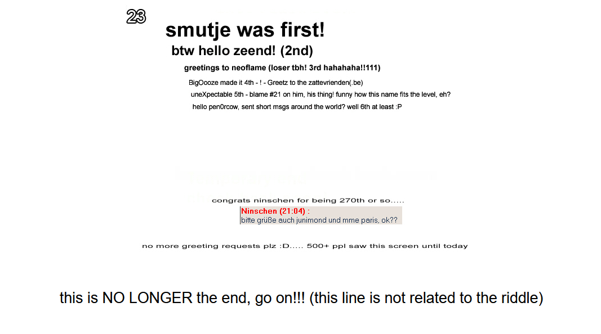
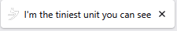

# Level 23

[Link level](https://notpron.com/notpron/beepbeep/unexpected.htm)

**Difficulty:** Very Easy

## Preview

## Solution
Here we are again after about 4 months, I had totally forgotten about this game but looking at my github profile I got the urge to play it again, in any case the solution to this level is very simple as you don't need to use developer tools, in fact the only hint we are given is the title of the page

The title says to look at the smallest unit we can see, so after trying various words like millimeter, I had an idea: what if it was referring to the pixels in the image?

That's exactly what I did: I downloaded the image and zoomed in as much as I could until I noticed some red dots on some letters.

After that i took all the letters that contained red pixels and after putting them together i got the word sound, so i replaced unexpected in the url with sound — and boom, level 23 completed!

---

_Time taken: 5 minutes_
