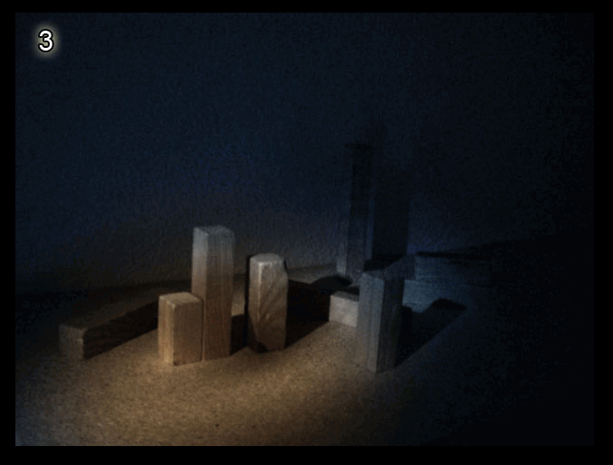
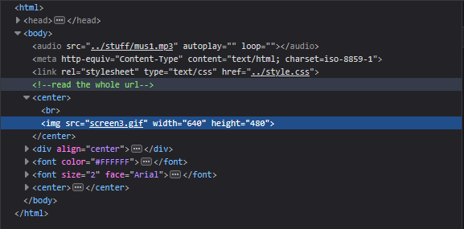
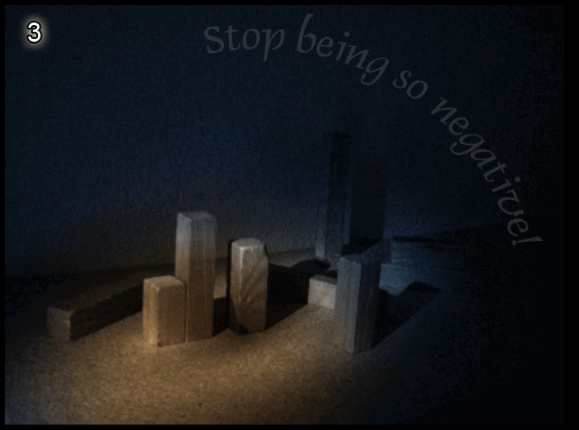

# Level 3

[Link level](https://notpron.com/notpron/not/level3.htm)

**Difficulty:** Very easy

## Preview

## Solution
This time there was no door, so the first thing I did was open the developer tools and started inspecting the code

From the inspected code we can notice two things, the first thing is the comment that makes us understand that we will have to modify something in the url, the second thing is that the image shown on the screen is actually not an image but a gif, so what I did was look at the gif until I noticed a writing

As you can see in the image, the gif contains the writing "stop being so negative", after which I went to recheck the url looking for something negative and I noticed the word false, the first thing I did was change the false to true — and boom, level 3 completed!

---

_Time taken: 15 seconds_
