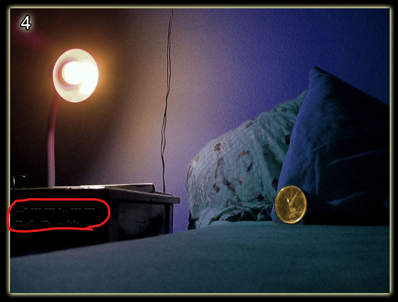
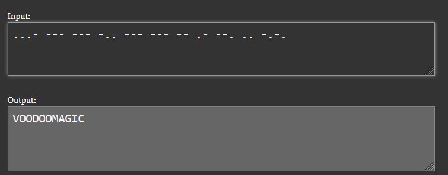

# Level 4

[Link level](https://www.deathball.net/notpron/true/movetotheothersite.php)

**Difficulty:** Easy

## Preview

## Solution
Again the first thing I did was open the developer tools to search for something but I didn't find anything, until I noticed the title of the web page

The title was clearly a clue, so I looked at the picture again and noticed that there was morse code on the cabinet.

After that I went to a site that decoded the morse code and I got two words namely voodoo magic

For a couple of minutes I searched these words on the internet thinking it was a song, but after not finding anything I decided to check the html again and I discovered that there was a button hidden in the image and that button was precisely that sort of gold watch, after clicking it it asked me to enter username and password which were respectively voodoo and magic — and boom, level 4 completed!

---

_Time taken: 10 minutes_
