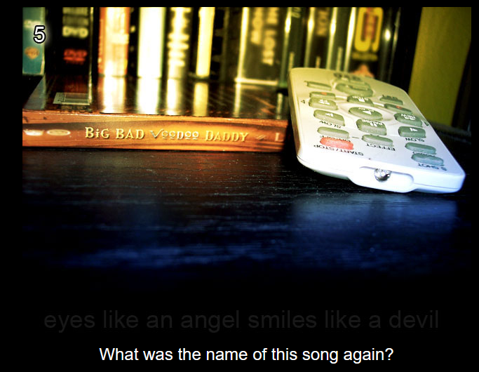
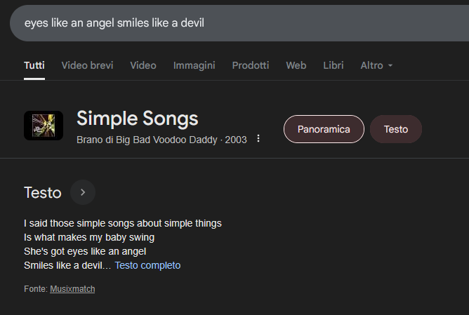

# Level 5

[Link level](https://www.deathball.net/notpron/google/shestheoneforme.php)

**Difficulty:** Very easy

## Preview

## Solution
The level asks what the name of this song is, the first thing I did was search for 'eyes like an angel smiles like a devil' in my browser and what I found was the name of the song

You can notice that the song is right because the authors of the song are the Big Bad Voodoo Daddy, just the writing that is present on that book, after that I inspected the source code to find the next link and I inserted simple and songs as username and password — and boom, level 5 completed!

---

_Time taken: 2 minutes_
