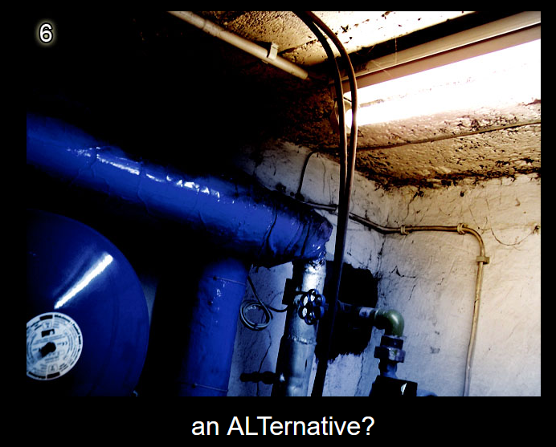
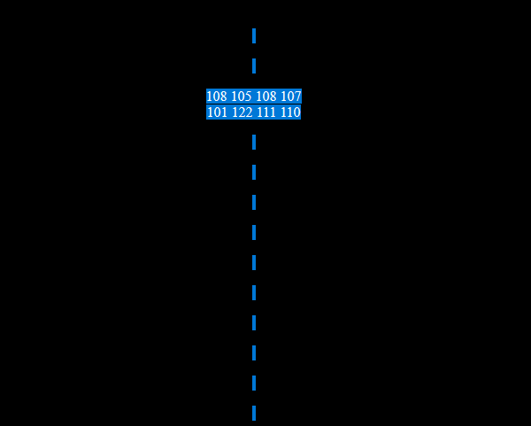
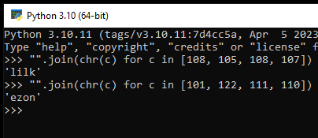
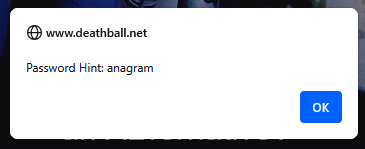

# Level 6

[Link level](https://www.deathball.net/notpron/nothing/hesgotitall.php)

**Difficulty:** Easy

## Preview

## Solution
Initially I wasted a couple of minutes trying to figure out if the image represented a pipe or if there was something hidden, in the end I realized that the page continued and at the end of the page there was a writing that said up

So what i did is go up a little bit and selecting the text i found some hidden numbers

I immediately recognized that they were ASCII characters and so I started writing a simple python script to convert these numbers into characters

After that I clicked on the white circle on the pipe to enter the credentials for the next level and it gave me the suggestion 'anagram'

So I started to make the anagram of the two words and I found the respective results (kill and zone), after that I entered them as username and password — and boom, level 6 completed!

---

_Time taken: 17 minutes_
