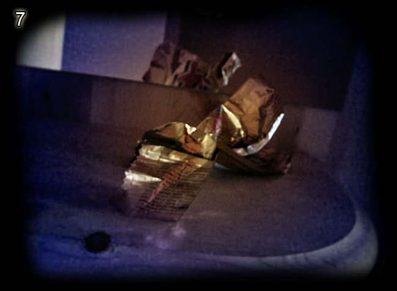
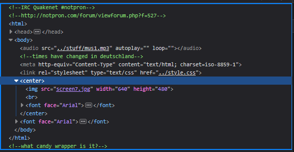
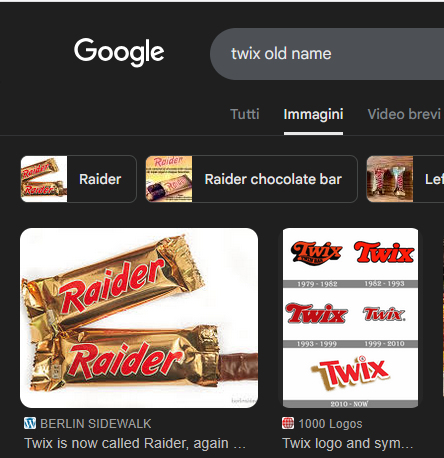
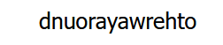

# Level 7

[Link level](https://www.deathball.net/notpron/sdrawkcab/tieman.htm)

**Difficulty:** Easy

## Preview

## Solution
The first thing I did was open the developer tools to inspect the code and here I found two suggestions

The suggestions lead to one conclusion: we need to find a candy with gold-colored paper that is Deutschland. Searching on the internet, the name came up, namely twix, so what i did was replace tieman.htm with twix.html

The site contains the word wenoot which read backwards means too new, so what I did was search the internet for the old name of twix

After finding out the old name was raider, i changed twix.htm to raider.htm

The site contains the word dnuorayawrehto which when read backwards means other way around, so what I did was check the site's URL and noticed that the word sdrawkcab was present, which when read backwards means backwards, so I replaced raider in the URL with its reverse, namely rediar — and boom, level 7 completed!

---

_Time taken: 10 minutes_
