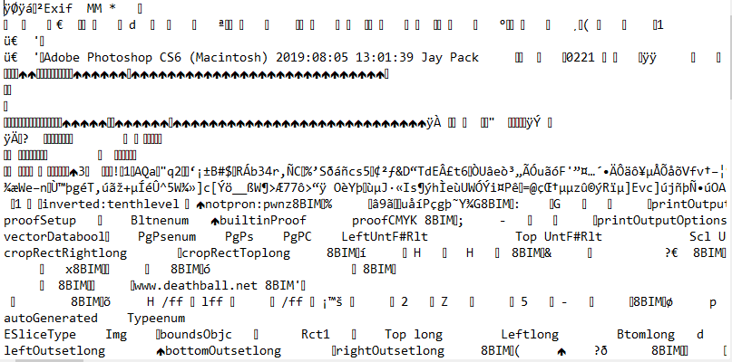

# Level 8

[Link level](https://www.deathball.net/notpron/sdrawkcab/rediar.htm)

**Difficulty:** Very easy

## Preview

## Solution
The first thing I did was open the developer tools to inspect the page code and that's where I noticed a new audio

The strange thing about this audio was that it couldn't be played because it was corrupted, so I downloaded the file and opened it with notepad to try to see if there was something hidden and that's where I noticed the Photoshop writing

Having noticed that it was created with Photoshop, the first thing I did was change the file extension from mp3 to png and that's where I got the credentials

After that I clicked on the guitar and entered the credentials — and boom, level 8 completed!

---

_Time taken: 1 minute_
