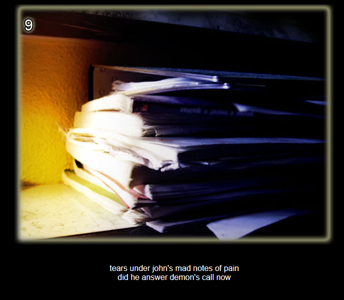
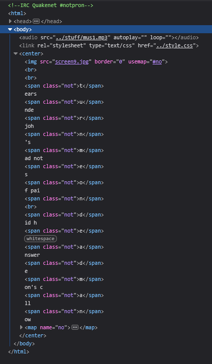

# Level 9

[Link level](https://www.deathball.net/notpron/luv2music/paulisdead.htm)

**Difficulty:** Very easy

## Preview

## Solution
Again I opened the developer tools to inspect the code and that's where I noticed that there were some letters that were assigned the class not

If we take all the letters with not before the br and after the br we get the words turnmeon and deadman, after which I clicked on the 9 in the image and entered these credentials — and boom, level 9 completed!

---

_Time taken: 1 minute_
